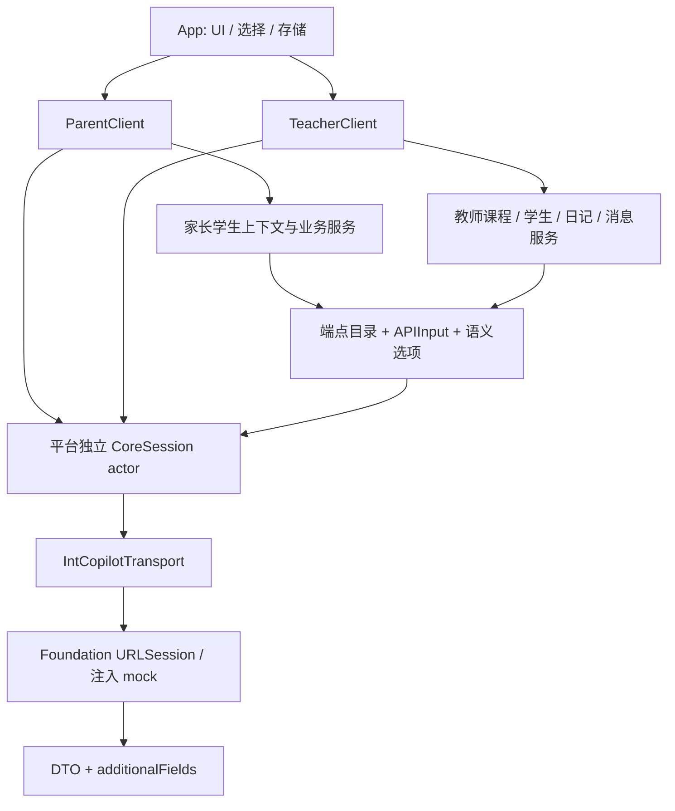

# 架构与边界

`IntCopilotTransport` 只处理 HTTP、内存 Cookie 和跳转边界，不知道学生、课节或 Token 业务。`CoreSession` 处理会话、认证头、上下文、错误和恢复。端点目录提供声明式契约，DTO 负责原始结构，`SemanticValue` / `SemanticOption` 负责业务语义。平台服务和工作流只组织依赖并填充参数。

家长与教师客户端各持有独立会话。默认传输器独立持有 Cookie；注入传输器时也应为每个客户端提供独立实例，尤其不能把不同账号放进共享 Cookie jar。认证头只构建给该环境的平台根地址，门户不接收平台 `X-Token`。URLSession 禁止自动重定向；上传或第三方下载不能通过任意地址转发会话凭据。

`ParentEndpoints` / `TeacherEndpoints` 保留逐步底层调用。常见工作流使用学校、学生、课程与带名称的选项；SDK 不替用户选择学生或原因，也不把读取选项与业务写入合并为隐式提交。

响应 DTO 使用原始字段名，覆盖所有抓包出现的字段和嵌套结构；空列表中未观察到的元素保留 `JSONValue`。`additionalFields` 保留模型未知字段，`presentFields` 保留缺失和 null 的区别。混合类型、全 null 和不能确定结构的字段保留 `JSONValue`。服务器删除必要字段或改变已确认字段类型时会抛解析错误，要求检查契约而非静默造数据。

包不包含 UI、设备存储、Keychain、后台任务或系统通知。网络和日期都在业务边界内显式传入；Unix 毫秒只在编码层转换。
