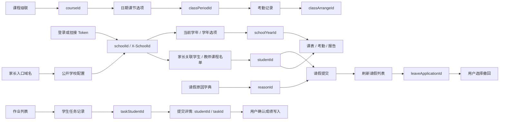

# 参数依赖与上下文

| 参数 | 来源 | 注意事项 |
|---|---|---|
| schoolId | `/api/login/schools`；家长按 domain 匹配，教师按账号上下文选 | 不能硬编码学校 8；权限由服务器验证 |
| schoolYearId | `/api/semester/currentSchoolYear` 或 `/api/dropDown/schoolYearRuleList` | student/{id} 路径中的数字是学年，不是学生 ID |
| studentId | 家长 `/api/student/list`；教师 `/api/course/students` | 与所选学校绑定，跨学校旧引用被拒绝 |
| courseId | 教师 `/api/course/cascadeBySchoolYear`；家长 `/api/dropDown/relatedAllCourses` | 级联叶节点 key 是课程 ID |
| classPeriodId | `/api/course/cascade/attendance` 的课程子节点 | 不等于具体 classArrangeId |
| classArrangeId | `/api/attendance/class` 的目标记录 | 登记使用原记录的学生与课节安排 |
| taskStudentId | 家长混合列表作业 entityId；教师 `/api/task/performance` | 教学资源条目的 entityId 不能套用 |
| taskId | 教师作业列表，或学生任务详情 | 成绩写入和学生详情中的 studentId/taskId 必须保持关联 |
| gradePeriodId | 家长报告周期；教师 `/api/monthly-grade/grade-period/{courseId}` | gradeTable 路径顺序是 gradePeriodId/courseId |
| reasonId | `/api/dropDown/leave-reasons` | 与具名原因一起返回，申请 type 按真实界面为 personal |
| leaveApplicationId | 提交后的请假记录列表 | 空 POST 响应不提供真实 ID；不能制造 ID |
| primaryTypeId / diaryEntryTypeId | 日记主类型 → 对应子类型 | 同名或同数字不能替代上游依赖 |
| parentId + studentId | `/api/dropDown/message/receiver` 的同一记录 | 发消息必须保留关联，不能只用家长 ID |
| resourceIds | 已确认上传流程返回的资源 ID | 上传有副作用，未知上传链保持实验标记 |

SDK 在常用 scope 中补充必要标识并保留完整上游记录。动态选项带学校和依赖元数据。逐接口的参数表进一步列出每个字段来源；静态发现中仍未知的路径或字典不会被自动猜测。
